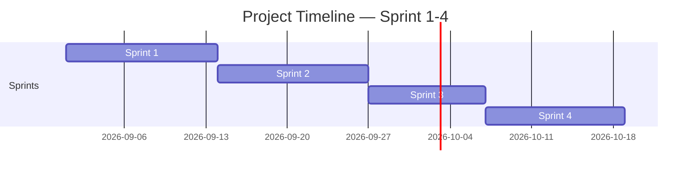

<!-- Template เต็มไฟล์สำหรับสร้าง docs/agile/02-sprint-backlog.md -->

<!-- ภาพรวมว่า Story ไหนไปอยู่ Sprint ไหนตลอด 4 Sprint — ไม่ต้องระบุคนรับผิดชอบ/Status ที่นี่ ส่วนนั้นอยู่ใน sprint-plan-[NN].md ของ Sprint ที่กำลังทำ -->

# Sprint Backlog

**Version:** 1.0 | **Last Updated:** 2026-09-01

> ภาพรวมว่า User Story ไหนจาก `01-product-backlog.md` จะไปอยู่ Sprint ไหน — Sprint ที่ยังไม่ถึงคือ draft คร่าวๆ ปรับได้เสมอเมื่อเข้าใจงานมากขึ้น

## Timeline (4 Sprint, Sprint ละ 10 - 13วัน)

| Sprint   | เริ่ม | สิ้นสุด |
| -------- | ---------- | -------------- |
| Sprint 1 | 2026-09-01 | 2026-09-12     |
| Sprint 2 | 2026-09-13 | 2026-09-25     |
| Sprint 3 | 2026-09-26 | 2026-10-5      |

> ปรับวันที่ให้ตรงกับวันที่ทีมเริ่มลงมือทำจริง (ถ้าไม่ใช่วันแลปนี้)

## Sprint 1 (กำลังทำ)

| # | User Story                                          | MoSCoW    | Estimate (SP) |
| - | --------------------------------------------------- | --------- | ------------- |
| 1 | As a player, I want to move                         | Must Have | 2             |
| 2 | As a player, I will attack to kill the enemy       | Must Have | 3             |
| 3 | As a player, I will throw head to stunt the enemy | Must Have | 4             |
| 4 | As a player, I will take damage                     | Must Have | 1             |
| 5 | As a player, I will get upgrade                     | Must Have | 1             |

## Sprint 2 (Draft)

| # | User Story                       | MoSCoW    | Estimate (SP) |
| - | -------------------------------- | --------- | ------------- |
| 1 | As a player, I want to save game | Must Have | 1             |

## Sprint 3 (Draft)

| # | User Story                                                                                                      | MoSCoW       | Estimate (SP) |
| - | --------------------------------------------------------------------------------------------------------------- | ------------ | ------------- |
| 1 | As a designer, I want to make Main menu                                                                         | Should Have  | 2             |
| 2 | As a designer, I want enemy spawn rate stored in a data file, so that I can tune difficulty without recompiling | Nice To Have | 5             |
| 3 | As a designer, I want enemy spawn in random position                                                            | Nice To Have | 5             |

> **Sprint 2-4 คือ draft ระดับ release plan** — เป้าหมายคือฝึกกะจำนวน SP ต่อ Sprint ให้ใกล้เคียง capacity ของทีม ไม่ใช่ล็อก scope ตายตัว ปรับได้ทุกครั้งที่ทำ Sprint Planning ของ Sprint ถัดไป
>
> เมื่อ Sprint ไหนเริ่มทำงานจริง ให้คัดลอก template `sprint-plan-template.md` (ไฟล์แนบใน LMS) ไปสร้าง `docs/agile/sprint-plan-[NN].md` แล้วดึง Story ของ Sprint นั้นจากตารางด้านบนมาใส่คนรับผิดชอบ แตก Task และปรับ Estimate ให้ละเอียดขึ้น

## Links

- [[docs/agile/01-product-backlog|Product Backlog]]
- [[docs/agile/sprint-plan-01|Sprint 1 Plan]].
